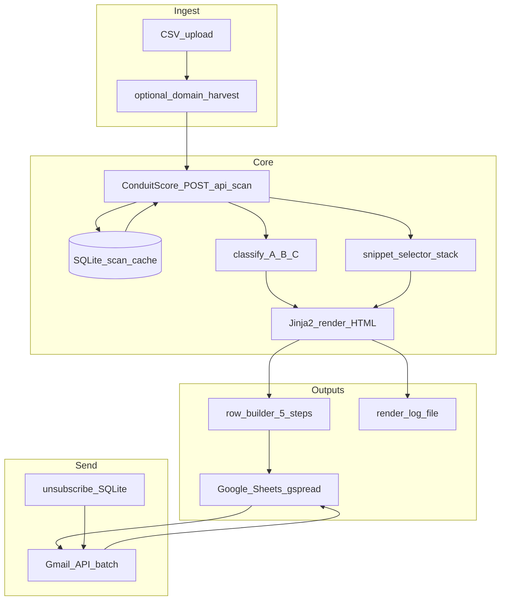

# Conduit Outreach Pipeline — Architecture

## Overview

End-to-end flow: **ingest prospect rows** → **scan + cache (ConduitScore)** → **classify sequence A/B/C** → **pick dynamic snippets** → **render 5 email steps (Jinja2 HTML)** → **append to Google Sheet** → **optional Gmail send** with rate limits and unsubscribe.

## Components

| Module | Responsibility |
|--------|----------------|
| `config.py` | `.env` loading (project → `REVERSE_FUNNEL_ENV_DIR` → cwd) |
| `db.py` | SQLite: scan cache, send idempotency, unsubscribe tokens |
| `conduit_cached.py` | `scan_domain_cached()` — TTL, skip duplicate domains |
| `classify.py` | Rules: Agency / E-com / SaaS default from `company_name`, `icp_tag`, override column |
| `snippets.py` | Keyword match on `top_issue` → max 4-line JSON-LD / llms.txt / fallback + stack flavor |
| `stack_detect.py` | Light `GET` homepage for Shopify / WordPress signals |
| `render_engine.py` | Build Jinja context: score, gap vs benchmark, UTM links, Ben voice |
| `sheet_schema.py` | Canonical column order for your Google Sheet |
| `sheets_sync.py` | gspread service account, `append_rows` batches |
| `gmail_sender.py` | OAuth, `users.messages.send`, retries, ~35/day cap |
| `cli.py` | `ingest`, `process`, `push-sheet`, `send` |

## Data model (one row per email step)

For each prospect you typically emit **5 rows** (`email_step` 1–5), same `receiver_email`, different `subject` / `body_html` / `body_text`. That matches mail-merge and “upload to Gmail” workflows.

## Idempotency

- **Scans**: cache key = normalized domain + optional `scan_id` from API; configurable TTL (hours).
- **Sheet push**: optional `--dedupe-key` on `(receiver_email, domain, email_step, template_version)` stored in SQLite `sheet_pushes` to avoid duplicate appends.
- **Send**: `message_id` stored per row hash; skip if already `sent`.

## Scaling to hundreds per day

- **ConduitScore**: raise effective throughput with `RATE_LIMIT_PER_MINUTE` and Agency unlimited scans; run multiple terminal processes on **different CSV slices** (e.g. `split -l 200`) pointing at the **same** SQLite DB and Sheet (last writer wins on cache).
- **Harvest**: bulk lists come from **your CSV** (domains + emails). Site crawling finds *published* emails only; high volume usually means **feeder CSVs** + dedupe, not only spidering.
- **Gmail**: consumer/workspace accounts hit daily send limits; module defaults **35/day**; use **multiple senders** or a proper ESP later.

## Google Sheet

Target spreadsheet ID is set in `.env` as `GOOGLE_SHEET_ID` (yours is pre-filled in `.env.example`). The **first worksheet** is used unless `GOOGLE_SHEET_WORKSHEET` is set. Share the sheet with the **service account email** from your JSON key.

## Links (honest URLs)

There is no live `https://conduitscore.com/verify/[domain]` product route today. The pipeline generates:

- **rescan_link** / **verify_link**: `https://conduitscore.com/?url=…&utm_*` (and scan `id` in query if present from API) so prospects land on a real scan entry point.
