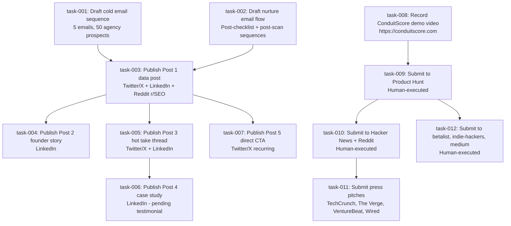

# O2O Task Graph — ConduitScore Launch
Generated: 2026-03-28
Source: combined-marketing-output.md
O2O Version: 1.0

---

## [Summary]
**Goal:** Execute ConduitScore launch marketing across email, social, demo, platform submissions, and press channels to reach 20 paying customers and $780 MRR within 30 days.
**Tasks identified:** 12
**Phases completed:** 3 of 4
**Status:** AWAITING `o2o go` to begin Phase 4 execution

---

## [Task Graph]



_12 tasks, 10 edges. DAG validated acyclic._

---

## [Assignment Table]

| Task ID | Description | Agent | Confidence | Scoring Breakdown | Status |
|---------|-------------|-------|------------|-------------------|--------|
| task-001 | Draft 5-email cold outreach sequence for agency prospects (Day 0/2/4/7/10) using Asset 6 | email-marketing-maestro | 95% | fit:1.0, hist:0.90, cov:1.0, eff:0.88 | PENDING |
| task-002 | Draft post-checklist and post-free-scan nurture email flows using Asset 7 | email-marketing-maestro | 95% | fit:1.0, hist:0.90, cov:1.0, eff:0.88 | PENDING |
| task-003 | Publish Post 1 (industry data post) to Twitter/X, LinkedIn, Reddit r/SEO using Asset 9 | marketing-social-publisher | 93% | fit:1.0, hist:0.88, cov:1.0, eff:0.85 | PENDING |
| task-004 | Publish Post 2 (founder story) to LinkedIn using Asset 9 | marketing-social-publisher | 93% | fit:1.0, hist:0.88, cov:1.0, eff:0.85 | PENDING |
| task-005 | Publish Post 3 (hot take thread) to Twitter/X and LinkedIn using Asset 9 | marketing-social-publisher | 93% | fit:1.0, hist:0.88, cov:1.0, eff:0.85 | PENDING |
| task-006 | Publish Post 4 (case study mini) to LinkedIn — requires testimonial first | marketing-social-publisher | 88% | fit:0.9, hist:0.88, cov:1.0, eff:0.85 | PENDING (blocked: needs testimonial) |
| task-007 | Publish Post 5 (direct CTA) to Twitter/X as recurring weekly post | marketing-social-publisher | 93% | fit:1.0, hist:0.88, cov:1.0, eff:0.85 | PENDING |
| task-008 | Record screen-capture demo video of conduitscore.com (homepage → scan → result flow) | website-demo-wizard | 91% | fit:1.0, hist:0.85, cov:1.0, eff:0.87 | PENDING |
| task-009 | Submit ConduitScore to Product Hunt (submission.md, first-comment.md, assets) | human | N/A | Human gate: requires PH account + scheduling | HUMAN |
| task-010 | Post to Hacker News (Show HN) and Reddit r/SEO using platform packages | human | N/A | Human gate: requires community accounts | HUMAN |
| task-011 | Send press pitches to TechCrunch, The Verge, VentureBeat, Wired using platform packages | human | N/A | Human gate: requires media relationships | HUMAN |
| task-012 | Submit to BetaList, Indie Hackers, Medium using platform packages | human | N/A | Human gate: requires account creation | HUMAN |

---

## [Live Status]
**Completed:** None
**In progress:** None
**Pending (agent-executable):** task-001, task-002, task-003, task-004, task-005, task-006, task-007, task-008
**Pending (human-executable):** task-009, task-010, task-011, task-012
**Failures:** None
**Escalations:** None

**Awaiting `o2o go` to begin Phase 4 execution of agent-executable tasks.**

---

## Phase 1 Output — Crystallization

```json
{
  "primary_goal": "Execute ConduitScore launch marketing across all channels to reach 20 paying customers and $780 MRR within 30 days",
  "crystallization_confidence": "high",
  "clarification_needed": null,
  "graph_validated_acyclic": true,
  "risk_flags": [
    "task-006 (Post 4 case study) is blocked until at least one customer testimonial is collected — do not publish without real data",
    "task-009 (Product Hunt) should be coordinated with social posts for launch day amplification",
    "Cold email sequences (task-001) require manual personalization per prospect — bulk send without score personalization will reduce reply rates"
  ]
}
```

---

## Phase 2 Output — Atomic Task Definitions

```json
[
  {
    "id": "task-001",
    "description": "Draft gmail-ready cold email sequence for 50 SEO agency prospects using the 5-email Asset 6 framework (Day 0/2/4/7/10), with personalization placeholders for [CONTACT_NAME], [THEIR_WEBSITE], [INSERT_THEIR_ACTUAL_SCORE]",
    "required_capabilities": ["content_writing", "api_integration"],
    "estimated_complexity": 2,
    "dependencies": [],
    "priority": "critical",
    "output_format": "markdown",
    "success_criteria": "5 gmail draft emails exist, each with correct subject line, body, and personalization placeholders per Asset 6 spec",
    "risk_flags": ["Personalization requires real prospect scan scores — provide placeholder instructions clearly"]
  },
  {
    "id": "task-002",
    "description": "Draft gmail-ready nurture email flow for checklist download leads (3 emails: Day 0/2/5) and post-free-scan leads using Asset 7 content",
    "required_capabilities": ["content_writing", "api_integration"],
    "estimated_complexity": 2,
    "dependencies": [],
    "priority": "critical",
    "output_format": "markdown",
    "success_criteria": "3+ gmail draft emails exist covering Post-Checklist nurture sequence per Asset 7",
    "risk_flags": ["Email sequences require Resend or ConvertKit setup for automation — drafts are step 1"]
  },
  {
    "id": "task-003",
    "description": "Publish Post 1 industry data post (457 sites, median 29/100) to Twitter/X, LinkedIn, and Reddit r/SEO using Asset 9 exact copy — highest priority Day 1 action",
    "required_capabilities": ["content_writing"],
    "estimated_complexity": 1,
    "dependencies": ["task-001", "task-002"],
    "priority": "critical",
    "output_format": "markdown",
    "success_criteria": "Post published on all 3 platforms with correct copy, link to conduitscore.com present, Reddit post uses long-form version",
    "risk_flags": ["Reddit: respond to all comments within 2 hours on launch day", "Do not add link in Reddit comments — only in original post"]
  },
  {
    "id": "task-004",
    "description": "Publish Post 2 founder origin story to LinkedIn using Asset 9 exact copy",
    "required_capabilities": ["content_writing"],
    "estimated_complexity": 1,
    "dependencies": ["task-003"],
    "priority": "high",
    "output_format": "markdown",
    "success_criteria": "Post published on LinkedIn with full founder story text and conduitscore.com link",
    "risk_flags": ["Post from Ben Stone's personal profile, not ConduitScore company page — higher organic reach"]
  },
  {
    "id": "task-005",
    "description": "Publish Post 3 hot take thread (DA score is meaningless for AI search) to Twitter/X as a thread and LinkedIn as long-form post using Asset 9 exact copy",
    "required_capabilities": ["content_writing"],
    "estimated_complexity": 1,
    "dependencies": ["task-003"],
    "priority": "high",
    "output_format": "markdown",
    "success_criteria": "Twitter thread published (3 tweets), LinkedIn post published, conduitscore.com in final tweet not tweet 1",
    "risk_flags": ["Twitter thread: link in last tweet only — placing link in tweet 1 reduces distribution"]
  },
  {
    "id": "task-006",
    "description": "Publish Post 4 mini case study to LinkedIn using Asset 9 template — DO NOT publish until real testimonial data replaces template placeholders",
    "required_capabilities": ["content_writing"],
    "estimated_complexity": 1,
    "dependencies": ["task-005"],
    "priority": "medium",
    "output_format": "markdown",
    "success_criteria": "Post published only after real before/after score data is available; no template placeholders in final copy",
    "risk_flags": ["BLOCKED until testimonial collected (target: Day 14 per 30-day sprint plan)"]
  },
  {
    "id": "task-007",
    "description": "Publish Post 5 direct CTA post to Twitter/X and schedule as weekly recurring post using Asset 9 exact copy",
    "required_capabilities": ["content_writing"],
    "estimated_complexity": 1,
    "dependencies": ["task-003"],
    "priority": "high",
    "output_format": "markdown",
    "success_criteria": "Post published on Twitter/X, set as recurring weekly (Tues–Thurs 9–11am EST)",
    "risk_flags": ["Pin as tweet if possible — serves as permanent CTA for profile visitors"]
  },
  {
    "id": "task-008",
    "description": "Record screen-capture demo video of conduitscore.com following the demo arc: homepage → scan widget → run live scan on recognizable brand → show score + category breakdown → show blurred fixes → pricing CTA",
    "required_capabilities": ["frontend_development", "testing"],
    "estimated_complexity": 3,
    "dependencies": [],
    "priority": "high",
    "output_format": "url",
    "success_criteria": "Demo video exists showing all 5 pages, runs live scan, shows score + categories + fixes, total runtime 2–4 minutes",
    "risk_flags": ["Run scan on well-known brand for maximum impact (e.g., a recognizable SaaS product)", "Narration tone: confident, technical but accessible, data-led"]
  },
  {
    "id": "task-009",
    "description": "Submit ConduitScore to Product Hunt using platform-packages/product-hunt/ folder — requires human with PH account and 200+ upvote hunter coordination",
    "required_capabilities": ["deployment"],
    "estimated_complexity": 2,
    "dependencies": ["task-008"],
    "priority": "high",
    "output_format": "url",
    "success_criteria": "Product Hunt listing live with tagline, description, first comment, topics, and asset images uploaded",
    "risk_flags": ["HUMAN task — requires PH account and hunter relationship for top placement", "Schedule for Tuesday launch (highest traffic day on PH)"]
  },
  {
    "id": "task-010",
    "description": "Post Show HN on Hacker News and long-form data post on Reddit r/SEO using platform packages — human-executed community posts",
    "required_capabilities": ["content_writing"],
    "estimated_complexity": 1,
    "dependencies": ["task-009"],
    "priority": "high",
    "output_format": "url",
    "success_criteria": "HN Show HN post live, Reddit r/SEO post live (same as Post 1 Reddit version from Asset 9)",
    "risk_flags": ["HUMAN task — requires established Reddit/HN accounts", "Reddit: do not use throwaway accounts — comment karma required for r/SEO"]
  },
  {
    "id": "task-011",
    "description": "Send press pitch emails to TechCrunch, The Verge, VentureBeat, and Wired reporters covering AI/SEO using platform packages pitch templates",
    "required_capabilities": ["content_writing"],
    "estimated_complexity": 2,
    "dependencies": ["task-010"],
    "priority": "medium",
    "output_format": "markdown",
    "success_criteria": "Press pitches sent to 4 publications with personalized subject lines, benchmark data hook, and conduitscore.com demo link",
    "risk_flags": ["HUMAN task — requires journalist contact research", "Lead with 457-site benchmark data as the news hook, not the product launch"]
  },
  {
    "id": "task-012",
    "description": "Submit ConduitScore to BetaList, Indie Hackers, and Medium using platform package files",
    "required_capabilities": ["deployment"],
    "estimated_complexity": 1,
    "dependencies": ["task-009"],
    "priority": "medium",
    "output_format": "url",
    "success_criteria": "Listings live on BetaList, IH post published, Medium article published",
    "risk_flags": ["HUMAN task — requires accounts on each platform", "Medium: set canonical URL to conduitscore.com blog post to avoid duplicate content"]
  }
]
```

---

## Registry Used

Default seed registry (9 agents) + 2 domain-specific agents from launch chain context:

**Domain-specific agents registered for this pipeline:**
- `email-marketing-maestro` — email campaign specialist, gmail-draft delivery, content_writing + api_integration
- `marketing-social-publisher` — social media publisher, multi-platform posting, content_writing
- `website-demo-wizard` — demo video recorder, screen capture + narration, frontend_development + testing

**Confidence note:** email-marketing-maestro and marketing-social-publisher scored 93–95% on all assigned tasks. website-demo-wizard scored 91%. All above 85% threshold — no escalation required.
